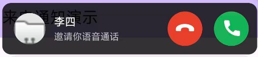
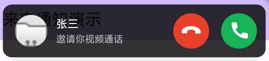
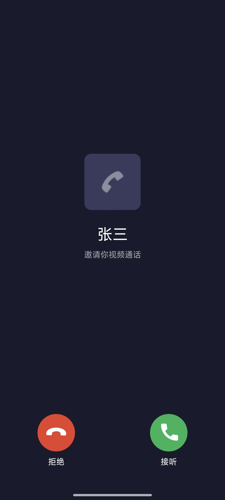

# Android 来电通知能力文档

> **call_notification_plugin** — 类似微信音视频通话的来电通知 Flutter 插件，支持悬浮通知、全屏来电界面、锁屏 CallStyle 通知等能力。

---

## 目录

- [效果图](#效果图)
- [功能概览](#功能概览)
- [场景能力矩阵](#场景能力矩阵)
- [快速开始](#快速开始)
- [CallData 参数详解](#calldata-参数详解)
- [回调说明](#回调说明)
- [场景行为详解](#场景行为详解)
- [设计约束与注意事项](#设计约束与注意事项)
- [完整示例代码](#完整示例代码)
- [辅助 API](#辅助-api)

---

## 效果图

### 语音通话悬浮通知



### 视频通话悬浮通知



### 全屏来电界面



---

## 功能概览

| 能力 | 说明 |
|---|---|
| **悬浮窗来电** | 使用 WindowManager 悬浮窗显示来电通知，不受 ROM 通知限制 |
| **锁屏通知** | 锁屏状态下使用系统 CallStyle 在消息栏展示（与微信一致，不可划掉） |
| **可划掉消息栏通知** | 解锁状态下发布可划掉通知，用户可左右滑动删除以取消来电 |
| **直接全屏** | `directToFullScreen=true` 时跳过悬浮窗，直接启动全屏界面 |
| **锁屏→解锁自动切换** | 锁屏来电在用户解锁后自动切换为悬浮通知或全屏界面 |
| **前台服务保活** | 前台服务（`FOREGROUND_SERVICE`）+ 通知栏常驻 |
| **铃声与振动** | 系统铃声循环播放 + 波形振动，自动管理生命周期 |
| **屏幕唤醒** | `PowerManager.WakeLock` + `ACQUIRE_CAUSES_WAKEUP` |
| **接听/挂断回调** | 接听、挂断、超时（滑动删除）操作回调 |
| **接听唤出应用** | 接听时启动 MainActivity 并携带 `extra` 数据，通过 `onCallAnswered` 回调返回 |

---

## 场景能力矩阵

插件支持以下7个核心场景，覆盖所有来电通知需求：

| 场景 | 设备状态 | directToFullScreen | 触发位置 | 行为 |
|---|---|---|---|---|
| **场景1** | 解锁 | false | App 内 | 悬浮通知 + 可划掉消息栏通知（划掉取消来电） |
| **场景2** | 锁屏→解锁 | false | 任意 | 锁屏消息栏（不可划掉）→ 解锁后悬浮通知 + 可划掉消息栏通知 |
| **场景3** | 解锁 | false | App 外 | 同场景1（权限足够时） |
| **场景4** | - | - | - | 悬浮通知可点击接听/挂断 |
| **场景5** | 锁屏→解锁 | false | 任意 | 锁屏消息栏 → 点击消息唤出解锁 → 解锁后悬浮通知 |
| **场景6** | 解锁 | true | 任意 | 直接全屏 |
| **场景7** | 锁屏→解锁 | true | 任意 | 锁屏消息栏 → 点击唤出解锁 → 解锁后直接全屏（无悬浮通知） |

---

## 快速开始

### 1. 添加依赖

在项目的 `pubspec.yaml` 中添加：

```yaml
dependencies:
  call_notification_plugin: ^1.0.0
```

或使用本地路径引用（开发阶段）：

```yaml
dependencies:
  call_notification_plugin:
    path: ../call_notification_plugin
```

然后执行：

```bash
flutter pub get
```

### 2. MainActivity 注册插件

在使用方的 `MainActivity.kt` 中注册插件并处理 `onNewIntent`（接听唤出应用时必需）：

```kotlin
package com.example.your_app

import android.content.Intent
import android.os.Bundle
import io.flutter.embedding.android.FlutterActivity
import com.callnotification.call_notification.CallNotificationPlugin

class MainActivity: FlutterActivity() {
    override fun onCreate(savedInstanceState: Bundle?) {
        super.onCreate(savedInstanceState)
        // 注册来电通知插件（必须）
        CallNotificationPlugin.registerWith(flutterEngine!!)
    }

    override fun onNewIntent(intent: Intent) {
        super.onNewIntent(intent)
        // 接听唤出应用时传递 Intent 给插件处理（必须）
        CallNotificationPlugin.instance?.handleNewIntent(intent)
    }
}
```

> **注意**：插件的 `AndroidManifest.xml` 已包含全部所需权限声明，使用方无需重复添加。

### 3. 初始化 + 监听回调

```dart
import 'package:call_notification_plugin/call_notification.dart';

void main() {
  WidgetsFlutterBinding.ensureInitialized();

  // 初始化来电通知管理器
  CallNotification.instance.init();

  // 监听操作回调
  CallNotification.instance.onAction = (action, callId) {
    debugPrint('操作: ${action.name}, ID: $callId');
  };

  // 监听接听唤出应用回调
  CallNotification.instance.onCallAnswered = (callData) {
    final callerName = callData['callerName'];
    final extra = callData['extra'];
    debugPrint('接听: $callerName, extra: $extra');
    // 跳转到通话页面...
  };

  runApp(const MyApp());
}
```

### 4. 请求权限（显示来电前必须调用）

```dart
// 传入 context 启用弹窗（默认 showPermissionDialog=true）
final granted = await CallNotification.instance.requestPermissions(
  context: context,
);
if (!granted) {
  // 用户取消弹窗或部分权限未授权
}
```

`requestPermissions()` 方法签名：

```dart
Future<bool> requestPermissions({
  BuildContext? context,
  bool showPermissionDialog = true,
})
```

**参数说明**：

| 参数 | 类型 | 默认值 | 说明 |
|---|---|---|---|
| `context` | `BuildContext?` | null | 用于显示弹窗的 BuildContext。传 null 则不显示弹窗 |
| `showPermissionDialog` | `bool` | true | 是否显示权限说明弹窗。`true` 且 `context` 有效时显示弹窗 |

**弹窗行为**：
- 先检查缺失的权限，**仅显示未授权的权限项**（已授权项不再提示）
- 弹窗显示"取消"和"去设置"两个按钮
- 用户点击"去设置" → 继续执行权限请求流程（弹系统权限对话框/跳转设置页）
- 用户点击"取消" → 直接返回 `false`，不执行权限请求
- 全部权限已授权时**不弹窗**，直接返回 `true`

`requestPermissions()` 仅请求来电通知**必需**的3项权限，遵循"不用则不要"原则：

| 权限 | 用途 | 说明 |
|---|---|---|
| 通知权限（POST_NOTIFICATIONS） | 显示消息栏通知 | Android 13+ 运行时权限 |
| 悬浮窗权限（SYSTEM_ALERT_WINDOW） | 渲染顶部悬浮通知 | 在其他应用上层显示来电浮窗 |
| 后台弹出界面权限（国产 ROM 专有） | 后台弹出悬浮层 | MIUI/EMUI/ColorOS 等 |

> 仅使用悬浮窗来电（不需要消息栏通知）时，可调用更轻量的 `requestOverlayOnlyPermission()` 替代完整 `requestPermissions()`。

### 最低权限前置检查（自动拦截）

调用 `showCallNotification` 时会自动检查最低权限前置条件，任一缺失则**直接不执行**并在 logcat 打印警告（Tag: `CallNotificationService`）：

| 检查项 | 缺失时日志 | 引导动作 |
|---|---|---|
| 通知权限（POST_NOTIFICATIONS，Android 13+） | `来电通知未执行：缺少通知权限（POST_NOTIFICATIONS）。请先调用 CallNotification.instance.requestPermissions() 请求权限。` | 调用 `requestPermissions()` |
| 渠道「音视频通话邀请通知」启用 | `来电通知未执行：渠道「音视频通话邀请通知」已禁用。请引导用户在系统「应用通知设置」中重新启用该渠道。` | 引导用户去系统通知设置 |
| 渠道「来电保活」启用 | `来电通知未执行：渠道「来电保活」已禁用。请引导用户在系统「应用通知设置」中重新启用该渠道。` | 引导用户去系统通知设置 |

### 5. 最简调用

```dart
await CallNotification.instance.showCallNotification(
  CallData(callerName: '张三'),
);
```

---

## CallData 参数详解

```dart
CallData({
  required String callerName,          // 必填 - 来电者名称
  String? callerAvatarUrl,             // 可选 - 来电者头像 URL
  CallType callType = CallType.audio,  // 可选 - 通话类型（默认语音）
  String? callId,                      // 可选 - 自动生成唯一 ID
  String? subtitle,                    // 可选 - 副标题（根据 callType 自动生成）
  int timeoutSeconds = 0,              // 可选 - 超时秒数（0=不超时）
  Map<String, dynamic>? extra,         // 可选 - 业务附加数据

  String? answerButtonText,            // 接听按钮文案（默认"接听"）
  String? rejectButtonText,            // 拒绝按钮文案（默认"拒绝"）
  bool showAnswerButton = true,        // 是否显示接听按钮
  bool showRejectButton = true,        // 是否显示拒绝按钮

  bool directToFullScreen = false,     // 是否直接唤出全屏（跳过悬浮窗）
})
```

### 参数说明

| 参数 | 类型 | 必填 | 默认值 | 说明 |
|---|---|---|---|---|
| `callerName` | `String` | **是** | 无 | 来电者名称，显示在所有界面 |
| `callerAvatarUrl` | `String?` | 否 | null | 来电者头像 URL（http/file/content），null 显示默认图标 |
| `callType` | `CallType` | 否 | `audio` | `audio`(语音) 或 `video`(视频)，影响副标题、图标、铃声 |
| `callId` | `String?` | 否 | 自动生成 | 唯一标识，回调时返回用于匹配通话 |
| `subtitle` | `String?` | 否 | 自动生成 | 名称下方副标题。不传则根据 callType 生成"邀请你XX通话" |
| `timeoutSeconds` | `int` | 否 | 0 | 超时时间，到期自动触发 `timeout` 回调。0 表示不超时 |
| `extra` | `Map<String, dynamic>?` | 否 | null | 业务数据，随 `onCallAnswered` 回调返回 |
| `answerButtonText` | `String?` | 否 | "接听" | 接听按钮文案 |
| `rejectButtonText` | `String?` | 否 | "拒绝" | 拒绝按钮文案 |
| `showAnswerButton` | `bool` | 否 | true | 是否显示接听按钮 |
| `showRejectButton` | `bool` | 否 | true | 是否显示拒绝按钮 |
| `directToFullScreen` | `bool` | 否 | false | 是否直接唤出全屏界面（跳过顶部悬浮窗） |

### CallType 枚举

```dart
enum CallType {
  audio,  // 语音通话 → 副标题："邀请你语音通话"
  video,  // 视频通话 → 副标题："邀请你视频通话"
}
```

---

## 回调说明

### onAction — 操作回调

当用户在通知/悬浮窗/全屏界面中执行操作时触发：

```dart
CallNotification.instance.onAction = (action, callId) {
  switch (action) {
    case CallAction.answer:
      debugPrint('用户接听了: $callId');
      break;
    case CallAction.reject:
      debugPrint('用户拒绝了: $callId');
      break;
    case CallAction.timeout:
      debugPrint('超时或滑动删除取消: $callId');
      break;
  }
};
```

> **注意**：用户在消息栏左右滑动删除来电通知时，也会触发 `CallAction.timeout`（表示来电被取消）。

### onCallAnswered — 接听唤出应用回调

当用户点击接听后，Native 端会启动 MainActivity 并携带来电数据：

```dart
CallNotification.instance.onCallAnswered = (callData) {
  final callerName = callData['callerName'];   // "张三"
  final callType = callData['callType'];       // "video"
  final callId = callData['callId'];           // "call_xxx"
  final extra = callData['extra'];             // {"roomId": "room_123"}

  // 跳转到通话页面...
  Navigator.push(context, MaterialPageRoute(
    builder: (_) => CallPage(roomId: extra?['roomId']),
  ));
};
```

**返回的数据结构**：

```json
{
  "callerName": "张三",
  "callType": "video",
  "callId": "call_1707890123_abc123",
  "subtitle": "邀请你视频通话",
  "extra": { "roomId": "room_123" }
}
```

---

## 场景行为详解

### 通知渠道与 ID

插件使用两种通知渠道：

| 渠道 ID | 名称 | 优先级 | 用途 |
|---|---|---|---|
| `call_notification_channel_lock_screen` | 音视频通话邀请通知 | IMPORTANCE_HIGH | 锁屏 CallStyle 通知（前台服务，ongoing 不可划掉） |
| `call_notification_channel_silent` | 来电保活 | IMPORTANCE_LOW | 静默保活通知 + 可划掉消息栏通知（不弹 Heads-up） |

通知 ID：

| ID | 用途 |
|---|---|
| `1001` (NOTIFICATION_ID) | 前台服务通知（锁屏 CallStyle 或 静默保活） |
| `1002` (CALL_NOTIFICATION_ID) | 解锁状态可划掉消息栏通知 |

### 场景1/3：解锁状态 + 非全屏

**触发条件**：设备解锁 + `directToFullScreen=false`

**行为**：
1. 前台服务：静默保活通知（IMPORTANCE_LOW，不弹 Heads-up）
2. 显示 WindowManager 顶部悬浮通知（含接听/挂断按钮）
3. 发布可划掉消息栏通知（普通样式，ongoing=false）
4. 用户可：
   - 点击悬浮通知接听/挂断按钮
   - 点击悬浮通知内容区 → 打开全屏界面
   - 点击消息栏通知 → 打开全屏界面
   - 左右滑动删除消息栏通知 → 取消来电（触发 `timeout` 回调）

### 场景2/5：锁屏状态 → 解锁 + 非全屏

**触发条件**：设备锁屏 + `directToFullScreen=false`

**锁屏阶段**：
1. 前台服务：CallStyle 通知（IMPORTANCE_HIGH，锁屏消息栏可见）
2. 通知 `ongoing=true`，**不可被左右滑动删除**（与微信一致）
3. 不显示悬浮通知，不显示全屏
4. 注册解锁监听（`ACTION_USER_PRESENT`）
5. 用户可：
   - 点击消息栏通知 → 唤出解锁界面
   - 直接按电源键解锁

**解锁后自动切换**：
1. 取消锁屏 CallStyle 通知（避免解锁后弹 Heads-up）
2. 切换前台服务为静默保活通知
3. 显示 WindowManager 顶部悬浮通知
4. 发布可划掉消息栏通知
5. 行为同场景1/3

### 场景6：解锁状态 + 全屏参数

**触发条件**：设备解锁 + `directToFullScreen=true`

**行为**：
1. 前台服务：静默保活通知
2. 直接启动 CallActivity 全屏来电界面
3. **不显示悬浮通知**
4. 不发布可划掉消息栏通知（全屏界面已有接听/挂断按钮）

### 场景7：锁屏状态 → 解锁 + 全屏参数

**触发条件**：设备锁屏 + `directToFullScreen=true`

**锁屏阶段**：
1. 前台服务：CallStyle 通知（ongoing，不可划掉）
2. 不显示悬浮通知，不显示全屏
3. 注册解锁监听

**解锁后自动切换**：
1. 取消锁屏 CallStyle 通知
2. 切换前台服务为静默保活通知
3. 直接启动 CallActivity 全屏界面
4. **不显示悬浮通知**

### 场景4：悬浮通知接听/挂断

悬浮通知包含两个按钮：
- **绿色接听按钮**（`ic_answer`）：点击后停止铃声 → 通知 Dart 端接听 → 启动 MainActivity 携带来电数据 → 关闭通知
- **红色挂断按钮**（`ic_hangup`）：点击后停止铃声 → 通知 Dart 端拒绝 → 关闭通知

---

## 设计约束与注意事项

### 注意1：全屏显示的触发条件

全屏显示**仅在以下三种情况**出现：
1. **点击悬浮通知**：悬浮通知内容区点击 → 打开 CallActivity
2. **解锁状态点击消息栏消息**：可划掉通知 contentIntent → 打开 CallActivity
3. **directToFullScreen=true**：直接启动 CallActivity

其他任何情况**不会**出现全屏显示（特别是锁屏状态下绝不全屏）。

### 注意2：CallStyle 不弹 Heads-up

插件**不使用 CallStyle 弹出顶部悬浮通知**（已有 WindowManager 悬浮通知）。

- 锁屏 CallStyle：使用 `CHANNEL_ID_LOCK_SCREEN`（IMPORTANCE_HIGH），仅在锁屏消息栏展示，解锁后立即取消
- 可划掉消息栏通知：使用 `CHANNEL_ID_SILENT`（IMPORTANCE_LOW），**不弹 Heads-up**
- 静默保活通知：使用 `CHANNEL_ID_SILENT`（IMPORTANCE_LOW），**不弹 Heads-up**

### 注意3：全屏参数时不显示悬浮通知

当 `directToFullScreen=true` 时：
- 解锁状态：直接全屏，不显示悬浮通知
- 锁屏→解锁：解锁后直接全屏，不显示悬浮通知

### 注意4：锁屏状态绝不全屏

锁屏状态下**任何情况**不可出现全屏显示：
- CallStyle 不设置 `fullScreenIntent`（避免锁屏自动全屏）
- 锁屏 contentIntent 指向 MainActivity（点击只唤出解锁界面，不直接全屏）
- 全屏界面仅在解锁状态启动

### Android 14+ 兼容性

Android 14（API 34）+ 限制 CallStyle 通知必须满足以下条件之一：
- 作为前台服务通知发布
- 使用 fullScreenIntent

插件的处理：
- 锁屏 CallStyle 作为**前台服务通知**发布（满足条件）
- 可划掉消息栏通知改用**普通通知样式**（非 CallStyle，规避限制）

---

## 完整示例代码

### 示例 1：最简视频来电（场景1）

```dart
await CallNotification.instance.showCallNotification(
  CallData(callerName: '张三', callType: CallType.video),
);
```

### 示例 2：带超时和额外数据的语音来电

```dart
await CallNotification.instance.showCallNotification(
  CallData(
    callerName: '李四',
    callType: CallType.audio,
    subtitle: '对方正在呼叫...',
    timeoutSeconds: 30,                          // 30秒未接听自动超时
    extra: {'roomId': 'room_123', 'isGroup': false},
  ),
);

// 监听超时或滑动删除
CallNotification.instance.onAction = (action, callId) {
  if (action == CallAction.timeout) {
    // 未接听或用户滑动删除通知，可发送忙线信号给对方
  }
};
```

### 示例 3：直接唤出全屏界面（场景6）

```dart
await CallNotification.instance.showCallNotification(
  CallData(
    callerName: '王五',
    callType: CallType.video,
    directToFullScreen: true,   // 跳过悬浮窗，直接全屏
  ),
);
```

### 示例 4：自定义按钮文案 + 仅显示接听按钮

```dart
await CallNotification.instance.showCallNotification(
  CallData(
    callerName: '紧急来电',
    answerButtonText: '立即接听',
    rejectButtonText: '挂断',
    showRejectButton: false,         // 隐藏拒绝按钮
  ),
);
```

### 示例 5：接听后携带参数进入通话页

```dart
// 1. 发起来电时携带业务数据
await CallNotification.instance.showCallNotification(
  CallData(
    callerName: '张三',
    callType: CallType.video,
    extra: {'roomId': 'room_456', 'token': 'abc123'},
  ),
);

// 2. 接听回调中获取数据
CallNotification.instance.onCallAnswered = (callData) {
  final roomId = callData['extra']?['roomId'];  // "room_456"
  final token = callData['extra']?['token'];   // "abc123"

  Navigator.of(context).push(MaterialPageRoute(
    builder: (_) => VideoCallRoom(roomId: roomId, token: token),
  ));
};
```

### 示例 6：隐藏按钮（纯展示型通知）

```dart
await CallNotification.instance.showCallNotification(
  CallData(
    callerName: '系统通知',
    callType: CallType.audio,
    showAnswerButton: false,  // 不显示接听按钮
    showRejectButton: false,  // 不显示拒绝按钮
  ),
);
```

### 示例 7：测试锁屏场景（场景2/5/7）

```dart
// 延迟 5 秒触发，给用户时间锁屏
ScaffoldMessenger.of(context).showSnackBar(
  const SnackBar(content: Text('5秒后将收到来电，请立即按电源键锁屏')),
);
await Future.delayed(const Duration(seconds: 5));

// 场景2/5：锁屏 + 非全屏
await CallNotification.instance.showCallNotification(
  CallData(
    callerName: '锁屏悬浮测试',
    callType: CallType.video,
    callId: 'lock_screen_overlay',
  ),
);

// 场景7：锁屏 + 全屏参数
await CallNotification.instance.showCallNotification(
  CallData(
    callerName: '锁屏全屏测试',
    callType: CallType.video,
    callId: 'lock_screen_fullscreen',
    directToFullScreen: true,
  ),
);
```

---

## 辅助 API

> 以下方法为**非重点辅助方法**，仅在需要精细控制权限时使用。日常使用 `requestPermissions()` 即可覆盖大部分场景。

### 单项权限检查与请求

| 方法 | 返回值 | 说明 |
|---|---|---|
| `checkNotificationPermission()` | `Future<bool>` | 检查通知权限（Android 13+） |
| `requestNotificationPermission()` | `Future<bool>` | 请求通知权限，`true` 表示已授权 |
| `checkOverlayPermission()` | `Future<bool>` | 检查悬浮窗权限（SYSTEM_ALERT_WINDOW） |
| `requestOverlayPermission()` | `Future<bool>` | 请求悬浮窗权限（跳转系统设置页） |
| `checkBackgroundPopupPermission()` | `Future<bool>` | 检查后台弹出界面权限（国产 ROM 专有） |
| `requestBackgroundPopupPermission()` | `Future<bool>` | 请求后台弹出界面权限（MIUI 跳转安全中心） |

> 通常使用 `requestPermissions()` 一次性请求全部权限即可，无需单独调用上述方法。

### ROM 类型识别

```dart
final romName = await CallNotification.instance.getRomName();
// 返回值：MIUI / EMUI / HarmonyOS / ColorOS / OriginOS / Flyme / Android
```

获取当前系统 ROM 类型名称，用于展示针对性的权限引导提示：

| 返回值 | 对应引导提示 |
|---|---|
| `MIUI` | 请在安全中心中开启「后台弹出界面」权限 |
| `EMUI` / `HarmonyOS` | 请在应用启动管理中允许后台活动 |
| `ColorOS` / `OriginOS` | 请关闭后台冻结 |
| `Flyme` | 请在通知管理中允许后台弹出 |
| `Android` | 原生系统，无特殊权限需求 |

### 打开应用详情设置页

```dart
await CallNotification.instance.openAppDetailSettings();
```

打开系统应用详情设置页，用于引导用户手动开启国产 ROM 专有权限（无标准 API 可检测，只能引导用户手动开启）。

---

## 内部架构

### 核心类

| 类 | 职责 |
|---|---|
| `CallNotificationService` | 前台服务，管理通知状态机、铃声、唤醒、解锁监听 |
| `CallOverlayView` | WindowManager 悬浮窗，显示顶部来电通知 |
| `CallActivity` | 全屏来电界面，锁屏/解锁双模式 |
| `CallActionReceiver` | 接收通知按钮/滑动删除的 Action 广播 |
| `CallRingtoneManager` | 铃声与振动管理 |
| `CallAlarmReceiver` | 定时来电调度（闹钟） |
| `CallNotificationPlugin` | Flutter MethodChannel 桥梁 |

### 通知状态机

```
handleShow(data)
    │
    ├─ 锁屏 → showLockScreenNotification
    │           ├─ CallStyle 前台服务通知（ongoing）
    │           └─ registerUnlockStateReceiver
    │                   └─ ACTION_USER_PRESENT → switchToUnlockedMode
    │                                               ├─ directToFullScreen=false → showOverlayMode
    │                                               └─ directToFullScreen=true  → showFullScreenMode
    │
    ├─ 解锁 + directToFullScreen=false → showOverlayMode
    │           ├─ 静默保活前台服务通知
    │           ├─ WindowManager 悬浮通知
    │           └─ 可划掉消息栏通知
    │
    └─ 解锁 + directToFullScreen=true → showFullScreenMode
                ├─ 静默保活前台服务通知
                └─ startActivity(CallActivity)

stopCallNotification（任意时刻）
    ├─ stopRinging
    ├─ cancel(CALL_NOTIFICATION_ID)
    ├─ stopForeground
    └─ stopSelf
```
